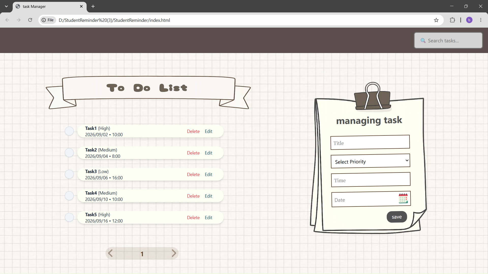

# ✅ Tasks Flow

A modern and responsive task management web application designed to help users organize and manage their daily tasks efficiently.

## 📌 About The Project

Tasks Flow is a web-based task management application where users can manage their tasks in a simple and organized interface.

The project focuses on creating a clean user experience with a modern design and responsive layout.

## ✨ Features

- ➕ Add and manage tasks
- 📅 Calendar functionality
- 🔐 Login page
- 📝 Sign up page
- 📱 Responsive design
- 🎨 Modern and clean user interface
- ⚡ Interactive functionality using JavaScript

## 🛠️ Built With

- HTML5
- Tailwind CSS
- JavaScript

## 📱 Responsive Design

Tasks Flow is designed to work smoothly across different devices, including:

- 💻 Desktop
- 💻 Laptop
- 📱 Mobile devices

The layout adapts to different screen sizes to provide a better user experience.

## 📂 Project Structure

```text
myTasks/
│
├── img/                         # Images and project assets
│
├── Animation - 1748522491321.json
├── index.html                   # Main application page
├── login.html                   # Login page
├── signup.html                  # Sign up page
├── style.css                    # Main stylesheet
├── mc-calendar.min.css          # Calendar library styles
├── mc-calendar.min.js           # Calendar functionality
└── README.md                    # Project documentation
```

## 🎨 Design

The project uses a modern and clean interface focused on usability and simplicity.

Some of the design features include:

- Clean layout
- Responsive components
- Modern UI elements
- Organized task display
- User-friendly interface

## 🚀 Getting Started

To run this project locally:

1. Clone the repository:

```bash
git clone https://github.com/bahar-farshchian/myTasks.git
```

2. Open the project folder.

3. Open `index.html` in your browser.

## 🔮 Future Improvements

- Add task categories
- Add task priorities
- Add due dates
- Add task search functionality
- Add dark mode 🌙
- Save tasks using Local Storage
- Add animations and transitions

## 📸 Preview





## 📄 License

This project was created for educational and portfolio purposes.

---

⭐ If you like this project, feel free to star the repository!

**Made with ❤️ by Bahar Farshchian**
